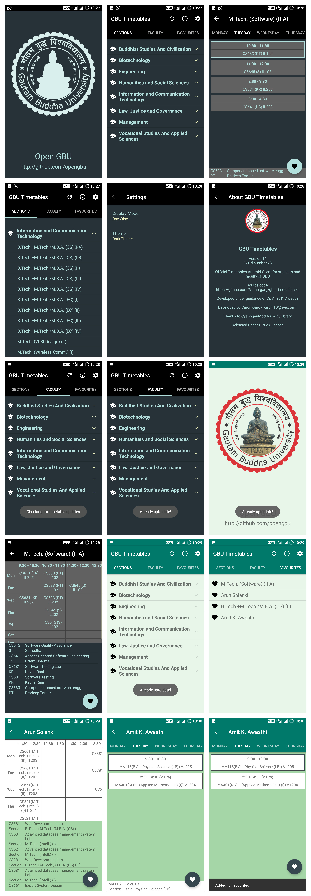

# GBU Timetables
Android application to view timetables for both faculty and students.  
https://play.google.com/store/apps/details?id=com.varun.gbu_timetables

## Features
- Background Service to automatically check and update database directly from timetable server, using REST and MD5 database hashing.

- Travis and Codacy support to automatically test builds and code quality from pull requests.

- Timetables are tailored according to user’s choice: single page timetables or day wise timetables.

- Support of both light and dark themes.

- Push Notifications to inform users of new or important activities.

- Public content provider is available for other developing applications using our services.

- In-depth analytics and crash reporting.

- Backword Compatiblity upto Android 4.0 (ICS). It was upto 2.3 (Gingerbread) till google decided to bump important libraries to Android 4.0 starting from android 8.0 (Oreo).

## Contributing
We welcome and enourage all kinds of contribution to the project.  
Please read our [contributing guidelines](CONTRIBUTING.md) to get started.

## Screenshots

